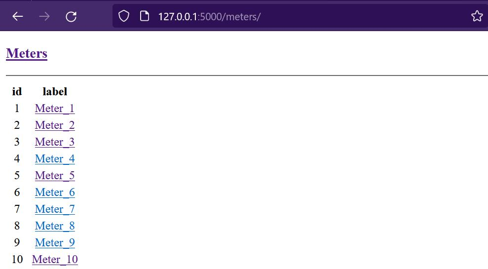
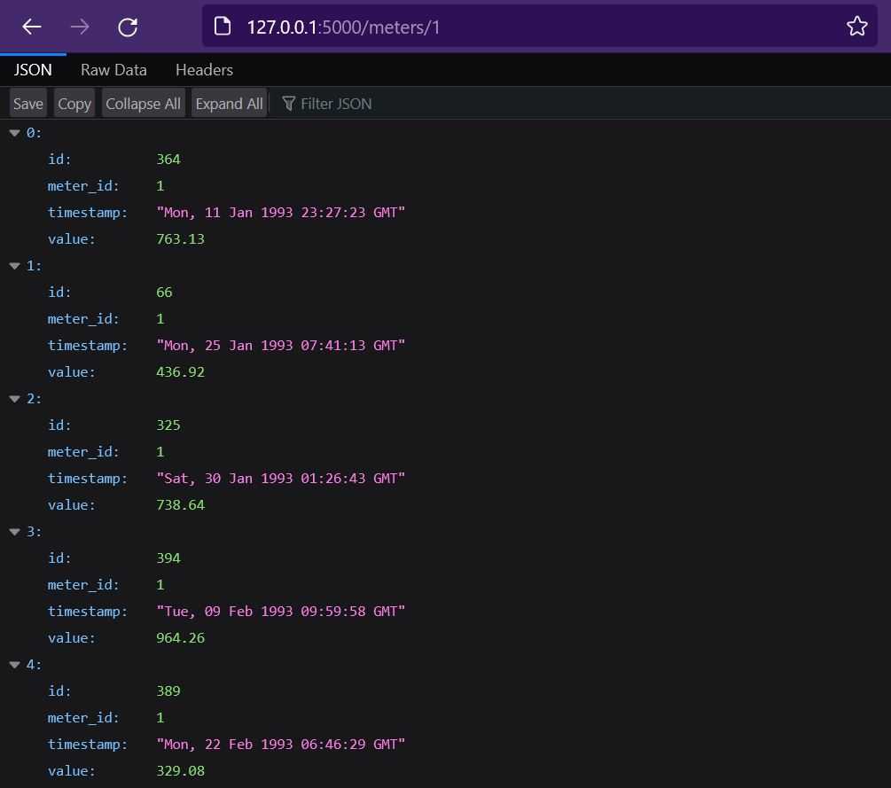

# LBS Coding Task 1

## How to run

1. Install [Docker](https://docs.docker.com/get-docker/).
2. From within the root directory of the repository copy `./env-template` file to `./.env`
3. Run `docker compose up --build`
    ```
    > docker compose up --build
    [+] Building 4.2s (18/18) FINISHED
    => [internal] load build definition from Dockerfile                                                                            0.1s
    => => transferring dockerfile: 32B                                                                                             0.0s
    => [internal] load .dockerignore                                                                                               0.0s
    => => transferring context: 2B                                                                                                 0.0s
    => [internal] load metadata for docker.io/library/python:3.9.16-slim                                                           3.2s
    => [internal] load build context                                                                                               0.1s
    => => transferring context: 12.90kB                                                                                            0.1s
    => [ 1/13] FROM docker.io/library/python:3.9.16-slim@sha256:9e0b4391fc41bc35c16caef4740736b6b349f6626fd14eba32793ae3c7b01908   0.0s
    => => resolve docker.io/library/python:3.9.16-slim@sha256:9e0b4391fc41bc35c16caef4740736b6b349f6626fd14eba32793ae3c7b01908     0.0s
    => CACHED [ 2/13] RUN apt-get update; apt-get install curl -y                                                                  0.0s
    => CACHED [ 3/13] RUN curl -sSL https://install.python-poetry.org | POETRY_HOME=/opt/poetry POETRY_VERSION=1.2.0 python &&     0.0s
    => CACHED [ 4/13] RUN groupadd -r appgrp                                                                                       0.0s
    => CACHED [ 5/13] RUN useradd -r -m appusr                                                                                     0.0s
    => CACHED [ 6/13] RUN usermod -a -G appgrp appusr                                                                              0.0s
    => CACHED [ 7/13] WORKDIR /app                                                                                                 0.0s
    => CACHED [ 8/13] RUN chown appusr:appgrp /app                                                                                 0.0s
    => CACHED [ 9/13] COPY --chown=appusr:appgrp ././pyproject.toml ././poetry.lock* ./                                            0.0s
    => CACHED [10/13] RUN poetry install --no-root --no-dev                                                                        0.0s
    => [11/13] COPY --chown=appusr:appgrp ././app ./app                                                                            0.1s
    => [12/13] COPY --chown=appusr:appgrp ././.env ./.env                                                                          0.1s
    => [13/13] COPY --chown=appusr:appgrp ././start_app.py ./start_app.py                                                          0.1s
    => exporting to image                                                                                                          0.3s
    => => exporting layers                                                                                                         0.3s
    => => writing image sha256:ab89972d7e0e998178b0507771fd57d93619ba7220ad09997d16b087a37cccdd                                    0.0s
    => => naming to docker.io/library/lbs_coding1-lbs-app                                                                          0.0s

    Use 'docker scan' to run Snyk tests against images to find vulnerabilities and learn how to fix them
    [+] Running 2/2
    - Network lbs_coding1_default  Created                                                                                         0.9s
    - Container lbs-app            Created                                                                                         0.1s
    Attaching to lbs-app
    lbs-app  | [2023-01-11 07:37:44,690] INFO in start_app: Creating database: lbs.sqlite3
    lbs-app  | [2023-01-11 07:37:44,722] INFO in start_app: Inserting meter data: meters: 100, readings per meter: 500
    lbs-app  | [2023-01-11 07:37:58,451] INFO in start_app: Database created, meter data inserted in 13.76s
    lbs-app  |  * Serving Flask app 'app'
    lbs-app  |  * Debug mode: on
    lbs-app  | WARNING: This is a development server. Do not use it in a production deployment. Use a production WSGI server instead.
    lbs-app  |  * Running on all addresses (0.0.0.0)
    lbs-app  |  * Running on http://127.0.0.1:5000
    lbs-app  |  * Running on http://172.30.0.2:5000
    lbs-app  | Press CTRL+C to quit
    lbs-app  |  * Restarting with stat
    lbs-app  |  * Debugger is active!
    lbs-app  |  * Debugger PIN: 216-784-166
    ```
4. Access the App via port 5000 on the localhost: `http://127.0.0.1/meters/`

    
    <br>
    <br>
    
    <br>

## Configuration settings

Settings for the app are managed by [Pydantic](https://docs.pydantic.dev/), that are loaded from the `.env` file in the root directory. These can be overrriden from with the `docker-compose.yml` file by using the `environment` directive for the `lbs-app` service.

## Database

SQLite database is created and populated with dummy meter data on startup if it does not already exist.
